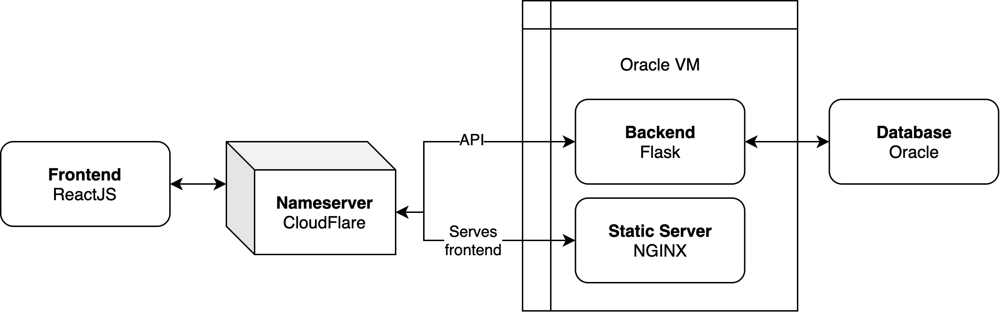

# storybook

A motivational storybook that helps students learn.

## Tech

Our web app uses Flask as our server-side framework, Oracle as our cloud platform, and CloudFlare as our firewall and DDOS protection. NGINX will act as a WSGI, and run multiple instances of our Flask app for reliability. Our backend will store data in a Oracle Cloud Database.

CloudFlare will cache the frontend, as well as monitor requests to the server for abuse.

This website is entirely server-side generated.

## Goals

 - Have a fully functioning web app 
 - A user can register, sign in, read a book, answer questions, and sign out
 - An admin can download all useful metadata about a user's progress and performance
 - 100% code coverage on backend API testing
 - Light-footprint on CPU and memory usage

## Directory Structure

 - `edu_storybook/`: Python Flask app to connect the database with the front end.
 - `test_edu_storybook/`: Unit tests for our Flask app using 
 - `docs/`: Documentation.

## Requirements

 - `Node >= 16.x`
 - `Python >= 3.x`

## Documentation

[Click here to access our prepared documentation for users and developers.](https://docs.google.com/document/d/1CelmwQA7AdvfGEHCVrNK-iNF4JQG2vA7apNBMwooBfk/edit)

[Click here to access our formal code documentation.](docs/README.md)
