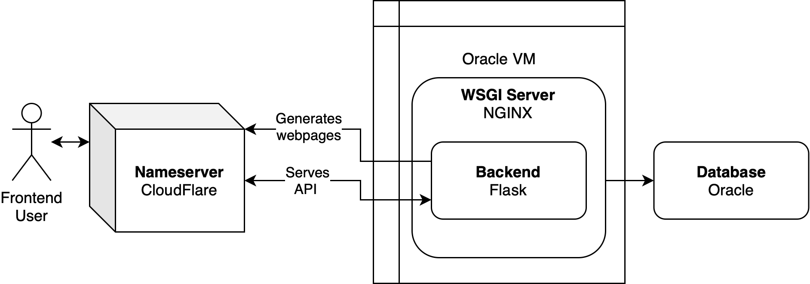

# Diagrams

These are all of the diagrams that we made for this project

## Storyboard

This is the general flow that a user may interact through our web app, between pages.

## Database Hierarchy

This is the high level overview of the database. Schools contain studies, studies contain books, books contain users and unique questions tied to each book.

## Schema Diagram

This is the actual layout of the database, as generated by SQL Developer.

## Tech Stack

This is the layout of our web app and how it works on our virtual machine, database, and to the user.

## Backend Password Reset Flow

This is the process that will happen to let a user reset their password.
